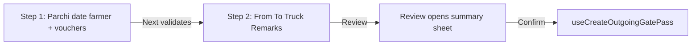

# Outgoing gate pass form — frontend guide

This document describes how the outgoing gate pass UI under `src/components/forms/outgoing/` is structured, how state flows between pieces, and how user actions become API payloads.

## Module map

| File | Role |
|------|------|
| `index.tsx` | **`OutgoingForm`** — TanStack Form, create/edit branching, two-step create wizard, summary sheet wiring, **`OutgoingVouchersSection`** — loads farmer passes, filters, hands table state |
| `outgoing-form-utils.ts` | Pure helpers: **`allocationKey`** / **`parseAllocationKey`**, grouping by date, location filters, bag rows per size, edit-mode allocation hydration |
| `outgoing-vouchers-table.tsx` | **`OutgoingVouchersTable`** — grouped table (date sections × R. Voucher × bag-size columns), wires cells and totals |
| `incoming-gate-pass-cell.tsx` | **`IncomingGatePassCell`** — one assignable slot (variety, stock ratio UI, dialog to enter quantity to remove) |
| `outgoing-summary-sheet.tsx` | **`OutgoingSummarySheet`** — side sheet to review **`CreateOutgoingGatePassBody`** before submit |
| `edit-outgoing-allocations.tsx` | **`EditOutgoingAllocations`** — edit-only table of issued lines keyed like create allocations |

Supporting types and mutations live outside this folder (for example `CreateOutgoingGatePassBody` and **`useCreateOutgoingGatePass`** in `src/services/outgoing-gate-pass/useCreateOutgoingGatePass.tsx`, incoming passes hook in `src/services/incoming-gate-pass/`).

---

## Core mental model: allocations live outside the form object

TanStack Form holds **metadata fields** (farmer, date, route, truck, remarks, manual parchi).  
**Quantities drawn from incoming vouchers** are stored in React state:

```ts
cellRemovedQuantities: Record<string, number>
```

Keys identify **one removable bag slot**: incoming pass ID + bag size name + **`bagIndex`** (same physical size can appear multiple times at different locations). Helpers in `outgoing-form-utils.ts` build and parse keys using the delimiter **`::`** (`ALLOCATION_KEY_DELIMITER`) so size names may safely contain hyphens.

Payload assembly (**`buildOutgoingPayload`** in `index.tsx`) walks positive entries in `cellRemovedQuantities`, resolves each key back to **`passId` / `sizeName` / `bagIndex`**, looks up **`getBagDetailsForSize`** on the live **`incomingPasses`** list for **location**, and groups allocations under **`incomingGatePassId`** for the API.

---

## Create flow (two steps + review sheet)

High-level sequence:



### Step 1 — header fields and incoming vouchers

Rendered when **`!isEditMode && createStep === 1`**:

1. **Manual parchi number** (optional string; must be empty or digits forming a positive integer when validated).
2. **Order date** — validated with **`payloadDateSchema`** (shared helper).
3. **Farmer** — **`SearchSelector`** over **`useGetAllFarmers`** active links; **`AddFarmerModal`** refetches the list after creation.

**Incoming gate passes** — **`OutgoingVouchersSection`** receives **`farmerStorageLinkId`** from the form subscription and **`cellRemovedQuantities`** setters:

- Loads **`useGetIncomingGatePassesOfSingleFarmer(farmerStorageLinkId)`**.
- **Variety gate**: if the farmer has any varieties on their passes, the UI requires choosing **a specific variety** before rows render (`needsVarietySelection`). Leaving “All” hides the table until a variety is picked.
- Optional filters: **chamber / floor / row** (pass matches if **any** bag location satisfies all selected dimensions).
- **Sort**: ascending or descending by **`gatePassNo`** (applied both to the flat filtered list and within **`groupIncomingPassesByDate`**).
- **Columns**: dropdown toggles which **bag size names** appear as table columns; when nothing is toggled, **all sizes present in the filtered list** show.

**Row checkbox (“select order”)**: selecting fills **`cellRemovedQuantities`** for **every visible size column** on that pass with each slot’s **`currentQuantity`** (only where stock &gt; 0). Deselecting removes **all keys** for that **`passId`**.

### Step 2 — logistics fields

Shows **From**, **To**, **Truck number** (uppercased on change / transform), **Remarks** (max length enforced in schema).

### Navigation and validation between steps

- **Next** (**`handleCreateNext`**) requires: farmer selected; manual parchi format OK if provided; **at least one positive allocation** in **`cellRemovedQuantities`**. On success **`createStep`** becomes **2** and the page scrolls to top.
- **Back** returns to step 1 without clearing allocations.

### Review and submit

On step 2, primary action **Review** (**`runPrimaryAction`**) sets a ref (**`openSheetRef`**) so **`form.handleSubmit`** knows to build the outgoing payload instead of treating the submit as step 1.

**`onSubmit`** (create branch):

1. Parses **`nextVoucherNumber`** from **`useGetReceiptVoucherNumber('outgoing')`** as **`gatePassNo`** (fallback **1** if missing).
2. Calls **`buildOutgoingPayload`** with form values, **`cellRemovedQuantities`**, and **`incomingPasses`** from the parent **`OutgoingForm`** hook instance (same farmer ID as the form field — needed for location resolution).

If there are no positive allocations, a toast asks the user to allocate in the table.

**`OutgoingSummarySheet`** displays **`pendingPayload`**; **Confirm** runs **`createOutgoing.mutate(pendingPayload)`**. Success closes the sheet, resets form state, clears allocations, bumps **`vouchersSectionKey`** (remounts **`OutgoingVouchersSection`**), and resets **`createStep`** to **1**.

---

## Table and cell UX (`OutgoingVouchersTable` → `IncomingGatePassCell`)

- Rows are grouped under **date labels** produced by **`groupIncomingPassesByDate`** / **`formatGroupDate`**.
- Each **size column** may contain **multiple stacked **`IncomingGatePassCell`** components** when **`getBagDetailsForSize`** returns more than one bag row for that size on that pass (**different **`bagIndex`** / locations**).
- **`IncomingGatePassCell`** shows **current vs initial** quantity and border styling by remaining percentage; clicking opens a dialog where quantity must be **&gt; 0**, **≤ currentQuantity**, numeric (**decimals allowed**, step **0.1**). Badge shows allocated amount; hover exposes quick clear (**`onQuickRemove`**).

Footer totals sum **`cellRemovedQuantities`** across visible columns.

---

## Edit flow (`OutgoingForm` with **`editEntry`**)

When **`editEntry`** is set:

- Header shows existing **gate pass number** from the daybook entry.
- **`cellRemovedQuantities`** is initialized with **`buildInitialAllocationsFromEntry(editEntry)`**, matching **`orderDetails`** to **`incomingGatePassSnapshots`** by gate pass number / size / optional **`bagIndex`**.
- **`EditOutgoingAllocations`** lists non-zero allocation rows (**`getEditAllocationRows`**) and edits them inline; quantities are **integers** (**`Math.floor`**) there, unlike the create dialog’s decimal-friendly input.
- **No** **`OutgoingVouchersSection`** or two-step wizard in edit mode.

**Important:** form **`onSubmit`** in edit mode currently builds a payload object and **`console.log`**s it — it does **not** call an update mutation in this file. Anyone wiring save behavior should replace that branch with the real API.

---

## Parent vs section data fetching

- **`OutgoingVouchersSection`** fetches incoming passes for table UX.
- **`OutgoingForm`** also calls **`useGetIncomingGatePassesOfSingleFarmer`** with the same **`farmerStorageLinkId`** so **`buildOutgoingPayload`** can attach **chamber / floor / row** from the latest pass shape at submit time.

Keep these in sync conceptually when changing how locations or bag rows are represented.

---

## Utilities quick reference (`outgoing-form-utils.ts`)

| Helper | Purpose |
|--------|---------|
| **`allocationKey` / `parseAllocationKey`** | Stable string keys for **`cellRemovedQuantities`** |
| **`getBagDetailsForSize`** | All bag lines for one size on one pass (**`bagIndex`** per line) |
| **`groupIncomingPassesByDate`** | Display groups sorted by voucher number within each date |
| **`passMatchesLocationFilters`** | Chamber / floor / row filter predicate |
| **`buildInitialAllocationsFromEntry`** | Edit form seed from daybook |
| **`getEditAllocationRows`** | Rows for **`EditOutgoingAllocations`** |

---

## Related API shape (submit)

Created documents should satisfy **`createOutgoingGatePassBodySchema`** in **`useCreateOutgoingGatePass.tsx`**: farmer link, **`gatePassNo`**, **`date`**, optional route / truck / **`manualParchiNumber`**, **`remarks`**, and **`incomingGatePasses`** each with **`variety`** and non-empty **`allocations`** (**`quantityToAllocate`** is a **positive integer** on the wire — note the create UI can type decimals in the cell dialog; downstream may coerce or reject depending on backend rules).

---

## Reset behavior

Form **Reset** clears TanStack Form defaults, **`cellRemovedQuantities`**, bumps **`vouchersSectionKey`**, and returns create mode to **step 1**. Separately, **Reset filters** inside **`OutgoingVouchersSection`** clears sort to asc, variety/location filters, column selection, selected orders, and **all** **`cellRemovedQuantities`**.
