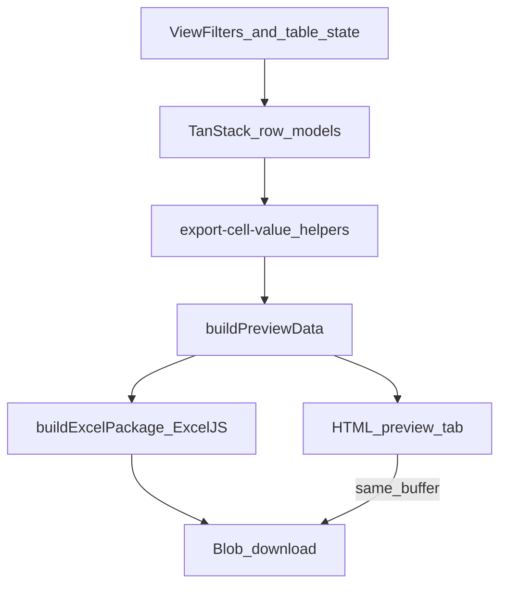

# Excel Implementation Guide

Portable playbook for exporting a TanStack Table (with view-filters) to a styled `.xlsx` file, with an optional HTML preview tab. This document explains how Coldop Website does it today, then how to recreate the same pattern in another project.

---

## 1. Overview & goals

**Goals of the export system**

1. Export exactly what the user sees after filters, grouping, sorting, and column visibility — not a second, divergent query of the raw dataset.
2. Produce a branded, printable Excel workbook (headers, section titles, totals, number formats).
3. Optionally open an HTML preview in a new tab that mirrors the workbook and offers the same download.
4. Keep ExcelJS out of the critical path: load it only when the user exports (or on hover preload).

**Core principle**

> The Excel builder never re-implements filters. It snapshots the live TanStack table instance after view-filters have already updated table state.

---

## 2. Package: ExcelJS 4.4.0

### Why ExcelJS

| Need | ExcelJS | CSV / lightweight writers |
|------|---------|---------------------------|
| Styled cells (fonts, fills, borders) | Yes | No / limited |
| Number formats (`numFmt`) | Yes | Text only |
| Merged header rows, rich text | Yes | No |
| Page setup (landscape, fit-to-width) | Yes | No |
| Browser `ArrayBuffer` output | `workbook.xlsx.writeBuffer()` | Varies |

Coldop uses **[`exceljs@^4.4.0`](https://www.npmjs.com/package/exceljs)** — still the latest published release as of this writing ([GitHub releases](https://github.com/exceljs/exceljs/releases)). Docs: [ExcelJS README](https://github.com/exceljs/exceljs#readme).

### Install

```bash
npm install exceljs@4.4.0
# or
pnpm add exceljs@4.4.0
```

### Dynamic load (required for SPA bundle size)

ExcelJS is large. Coldop never statically imports the runtime in the main chunk:

```ts
// src/lib/load-exceljs.ts
import type ExcelJS from 'exceljs';

let cachedExcelJS: typeof ExcelJS | null = null;
let excelJSLoadPromise: Promise<typeof ExcelJS> | null = null;

export function preloadExcelJS(): Promise<typeof ExcelJS> {
  return loadExcelJS();
}

export async function loadExcelJS(): Promise<typeof ExcelJS> {
  if (cachedExcelJS) return cachedExcelJS;

  excelJSLoadPromise ??= import('exceljs').then((module) => {
    cachedExcelJS = module.default;
    return cachedExcelJS;
  });

  return excelJSLoadPromise;
}
```

**Pattern**

- Use `import type ExcelJS from 'exceljs'` for types only (erased at compile time).
- Call `await loadExcelJS()` inside the export function.
- Optionally call `preloadExcelJS()` on Export-button hover so the first click feels instant.

### APIs used in this project

```ts
const ExcelJS = await loadExcelJS();
const workbook = new ExcelJS.Workbook();
const worksheet = workbook.addWorksheet('Report', {
  views: [{ showGridLines: false }],
});

worksheet.mergeCells(`A1:${lastColumnLetter}1`);
worksheet.addRow(headers);
worksheet.addRows(bodyValueArrays);

cell.fill = { type: 'pattern', pattern: 'solid', fgColor: { argb: 'FFDCEFE4' } };
cell.border = { /* thin borders */ };
cell.font = { name: 'Calibri', size: 10, bold: true };
cell.alignment = { horizontal: 'center', vertical: 'middle', wrapText: true };
cell.numFmt = '#,##,##0'; // locale-friendly integer format

worksheet.columns = headers.map((header, index) => ({
  key: header,
  width: columnWidths[index],
}));

worksheet.pageSetup = {
  orientation: 'landscape',
  fitToPage: true,
  fitToWidth: 1,
  fitToHeight: 0,
};

const buffer = (await workbook.xlsx.writeBuffer()) as ArrayBuffer;
```

Download in the browser:

```ts
downloadBlob(
  new Blob([buffer], {
    type: 'application/vnd.openxmlformats-officedocument.spreadsheetml.sheet',
  }),
  fileName,
);
```

(`downloadBlob` creates an object URL, clicks a temporary `<a download>`, then revokes the URL.)

---

## 3. Coldop architecture & file map



### Shared infrastructure

| Layer | Path | Role |
|-------|------|------|
| Preview types + HTML tab | [`src/lib/excel-preview-tab.ts`](src/lib/excel-preview-tab.ts) | `ExcelPreviewData`, HTML renderer, `openExcelPreviewInNewTab` |
| Lazy ExcelJS | [`src/lib/load-exceljs.ts`](src/lib/load-exceljs.ts) | Cached dynamic import |
| Theme / branding | [`src/lib/export-report-theme.ts`](src/lib/export-report-theme.ts) | Shared ARGB colors, integer `numFmt` |
| Blob download | [`src/lib/download-blob.ts`](src/lib/download-blob.ts) | One-shot download + revoke |

### Two export styles in this repo

#### A. Live table → Excel (best template for another project)

Used by **incoming** and **outgoing** reports.

| Step | File |
|------|------|
| Cell / row / filter helpers | [`src/features/incoming-report/utils/export-cell-value.ts`](src/features/incoming-report/utils/export-cell-value.ts) |
| Preview + workbook builder | [`src/features/incoming-report/utils/export-incoming-report-excel.ts`](src/features/incoming-report/utils/export-incoming-report-excel.ts) |
| Toolbar handler | [`src/features/incoming-report/index.tsx`](src/features/incoming-report/index.tsx) |

Flow:

1. Read `table.getVisibleLeafColumns()`.
2. Collect rows with `collectExportRows(table)` (sorted model; flatten groups).
3. Map each cell with `getExportCellForRow` → `exportCellValueToPrimitive`.
4. Build `filterSummaryLines` from the same table state.
5. Build a shared `preview` DTO, then write the ExcelJS workbook from the same arrays.

#### B. Farmer stock ledger (specialized)

Used by **people-report** farmer ledger.

| Step | File |
|------|------|
| Filtered entry IDs from tables | [`getFilteredGatePassEntriesFromTable`](src/features/people-report/utils/export-cell-value.ts) |
| Rebuild ledger sections | PDF/ledger data builders under `src/features/people-report/utils/` |
| Filter summary | [`build-farmer-report-filter-summary.ts`](src/features/people-report/utils/build-farmer-report-filter-summary.ts) |
| Excel package | [`build-farmer-stock-ledger-excel.ts`](src/features/people-report/utils/build-farmer-stock-ledger-excel.ts) |
| Download wrapper | [`export-farmer-stock-ledger-excel.ts`](src/features/people-report/utils/export-farmer-stock-ledger-excel.ts) |

Flow:

1. View-filters update shared table state (incoming + outgoing + control table).
2. Export takes the **union of filtered gate-pass entries** from both tables.
3. Rebuilds ledger sections / PDF-shaped items (grouping, sizes, footers).
4. Maps those items into Excel body rows (`ledgerItemsToBodyRows`).
5. Writes filter summary into a merged header row (row 5 for farmer; row 4 for simpler reports).

Prefer **style A** when porting unless you also need multi-section ledger rebuilds.

---

## 4. How Excel honors TanStack Table + view-filters

### Row model pipeline (TanStack Table v9)

From the [Row Models guide](https://tanstack.com/table/v9/docs/guide/row-models):

```
getCoreRowModel
  → getFilteredRowModel
  → getGroupedRowModel
  → getSortedRowModel
  → getExpandedRowModel
  → getPaginatedRowModel
  → getRowModel
```

| Concern | TanStack API | Coldop usage |
|---------|--------------|--------------|
| Filtered rows | `table.getFilteredRowModel()` | Empty-export guard; leaf entry extraction |
| Sorted + grouped order | `table.getSortedRowModel()` | `collectExportRows` walks `rows` + `subRows` |
| Visible columns / order | `table.getVisibleLeafColumns()` | Headers and cell mapping |
| Visibility-aware cells | `row.getVisibleCells()` | Inside `getExportCellForRow` |
| Group / aggregate / placeholder | `cell.getIsGrouped()`, `getIsAggregated()`, `getIsPlaceholder()` | Label rows, sums, blank placeholders |
| Audit trail in file | Custom | `buildFilterSummaryLines(table)` → merged workbook row |

Official docs:

- [Column Filtering (React, v9)](https://tanstack.com/table/v9/docs/framework/react/guide/column-filtering)
- [Global Filtering (React, v9)](https://tanstack.com/table/v9/docs/framework/react/guide/global-filtering)
- [Column Visibility](https://tanstack.com/table/v8/docs/guide/column-visibility) — always prefer **visible** APIs (`getVisibleLeafColumns`, `getVisibleCells`), not `getAllLeafColumns` / `getAllCells`
- [v9 reference: `table_getVisibleLeafColumns`](https://tanstack.com/table/latest/docs/reference/static-functions/functions/table_getVisibleLeafColumns)
- Maintainer tip on exporting filtered data: [TanStack Table Discussion #4684](https://github.com/TanStack/table/discussions/4684)

### Critical: pagination vs full export

- `table.getRowModel()` respects **pagination** (current page only) when pagination is enabled.
- Exports should use the **pre-pagination** filtered/sorted view:
  - `getFilteredRowModel()` / `getSortedRowModel()` / `getPrePaginatedRowModel()`, or
  - a custom `collectExportRows` that walks the sorted (grouped) model.

Coldop’s `collectExportRows`:

```ts
export function collectExportRows(table: AppTable<TData>): AppRow<TData>[] {
  const grouping = table.store.state.grouping;

  if (grouping.length === 0) {
    return table.getSortedRowModel().rows;
  }

  function flattenGroupedRows(rows: AppRow<TData>[]): AppRow<TData>[] {
    const result: AppRow<TData>[] = [];
    for (const row of rows) {
      result.push(row);
      if (row.subRows.length > 0) {
        result.push(...flattenGroupedRows(row.subRows));
      }
    }
    return result;
  }

  // Sorting runs after grouping — use the sorted model.
  return flattenGroupedRows(table.getSortedRowModel().rows);
}
```

### Visible columns from view-filters

View-filters UI updates `columnVisibility`, `columnOrder`, `columnFilters`, `globalFilter`, `grouping`, and `sorting` on the same table instance the grid renders. Export then does:

```ts
const visibleColumns = table.getVisibleLeafColumns();
const headers = visibleColumns.map((column) => getColumnExportLabel(column));
const exportRows = collectExportRows(table);

const bodyRows = exportRows.map((row) => ({
  values: visibleColumns.map((column) =>
    exportCellValueToPrimitive(getExportCellForRow(row, column)),
  ),
  isGroupedOrAggregatedRow: row.getIsGrouped(),
}));
```

Hidden columns never appear in the workbook. Reordered columns keep the user’s order.

### Typed cell values

Prefer a small discriminated union so Excel gets real numbers (not formatted strings):

```ts
type ExportCellValue =
  | { kind: 'empty' }
  | { kind: 'text'; value: string }
  | { kind: 'number'; value: number; format?: 'integer' };

function exportCellValueToPrimitive(cell: ExportCellValue): string | number {
  if (cell.kind === 'empty') return '';
  if (cell.kind === 'number') return cell.value;
  return cell.value;
}
```

When writing Excel cells, if `typeof value === 'number'`, set `cell.numFmt`.

### Filter summary lines (audit trail)

Users need to know *which* filters produced the file. Coldop builds human-readable lines from table state and writes them into a merged header row:

```ts
filterRow.getCell(1).value =
  filterSummaryLines.length > 0
    ? filterSummaryLines.join('\n')
    : 'Filters: none applied';
```

Typical lines:

- Date range / period
- Quantity mode or other view prefs
- Active column filters
- Advanced global filter conditions
- `Grouped by: …`
- `Sorted by: …`

Build these from the **same** table instance; do not reconstruct filters from URL alone unless that is the single source of truth for the grid.

---

## 5. Preview tab vs download

### Shared package shape

Both preview and download should come from one builder:

```ts
type ExcelPackage = {
  buffer: ArrayBuffer;
  fileName: string;
  preview: ExcelPreviewData;
};
```

`ExcelPreviewData` (see [`excel-preview-tab.ts`](src/lib/excel-preview-tab.ts)) holds title, subtitle, headers, row metadata (`isSectionTitle`, `isTotalsRow`, `isGroupedOrAggregatedRow`, `boldByColumn`), optional stock summary, and meta lines.

### `openExcelPreviewInNewTab` flow

1. `window.open('', '_blank')` immediately (avoids popup blockers after `await`).
2. Write a lightweight loading HTML document.
3. `await buildExport()` → `{ buffer, fileName, preview }`.
4. Create a blob URL for the `.xlsx` buffer; store it in a ref for later revoke.
5. Replace the tab document with escaped HTML that mirrors the preview DTO.
6. Wire the Download button’s `href` to the blob URL (`download` attribute = file name).
7. On failure, write an error page into the preview tab and rethrow.

**Caps:** `EXCEL_PREVIEW_MAX_ROWS = 400` — HTML truncates for responsiveness; the Excel file still contains all rows. Show a notice when truncated.

**Security:** always `escapeHtml` user/content strings before injecting into the preview document.

### Direct download

```ts
const { buffer, fileName } = await buildExcelPackage(input);
downloadBlob(
  new Blob([buffer], {
    type: 'application/vnd.openxmlformats-officedocument.spreadsheetml.sheet',
  }),
  fileName,
);
```

Some Coldop report previews also `postMessage` a download request back to the opener so the parent page runs the same export path (keeps auth/table context in the app window).

---

## 6. Porting checklist (another project)

Use this when you already have a TanStack Table + view-filters UI and want Excel export.

### Step 1 — Install and lazy-load ExcelJS

```bash
npm install exceljs@4.4.0
```

Copy the `loadExcelJS` / `preloadExcelJS` pattern from §2.

### Step 2 — Register row models on the table

**TanStack Table v9** ([docs](https://tanstack.com/table/v9/docs/guide/row-models)):

```ts
const features = tableFeatures({
  columnFilteringFeature,
  globalFilteringFeature, // if needed
  columnVisibilityFeature,
  rowSortingFeature,
  rowGroupingFeature, // if needed
  rowPaginationFeature, // optional for UI
  filteredRowModel: createFilteredRowModel(),
  sortedRowModel: createSortedRowModel(),
  groupedRowModel: createGroupedRowModel(), // if grouping
  paginatedRowModel: createPaginatedRowModel(), // UI only
  // register only the filterFns / sortFns you use
});
```

**v8-style APIs** (if still on v8): pass `getFilteredRowModel()`, `getSortedRowModel()`, etc. into `useReactTable`.

View-filters must mutate **this** table’s state (`setColumnFilters`, `setColumnVisibility`, …), not a disconnected copy.

### Step 3 — Snapshot on Export click

```ts
async function handleExportExcel() {
  const visibleColumns = table.getVisibleLeafColumns();
  const exportRows = collectExportRows(table);
  const filteredLeafCount = /* count leaf data rows from getFilteredRowModel() */;

  if (filteredLeafCount === 0) {
    throw new Error('No rows to export. Adjust filters or load report data.');
  }

  const filterSummaryLines = buildFilterSummaryLines(table);
  // … build package …
}
```

Pass the live `table` instance (or a serializable snapshot of rows/columns derived from it) into the builder. Do not re-query the API with different filter logic unless server-side filtering already produced `data`.

### Step 4 — Map cells consistently with the UI

- Use `getVisibleCells()` / column ids that match the grid.
- Handle grouped / aggregated / placeholder cells the same way the grid does.
- Coerce numeric columns to `number` for Excel.

### Step 5 — Build preview DTO + workbook from the same arrays

```ts
function buildPreviewData(...): PreviewData { /* headers + rows + filterSummaryLines */ }

async function buildExcelPackage(...): Promise<ExcelPackage> {
  const preview = buildPreviewData(...);
  const ExcelJS = await loadExcelJS();
  // write workbook using preview.headers / preview.rows (or the same source arrays)
  const buffer = (await workbook.xlsx.writeBuffer()) as ArrayBuffer;
  return { buffer, fileName: preview.fileName, preview };
}
```

### Step 6 — Header block in the worksheet

Suggested layout (Coldop-style):

1. Title (merged)
2. Subtitle / report name
3. Metadata (generated at, row count, entity info)
4. Filter summary (`filterSummaryLines.join('\n')`)
5. Branding / footer note
6. Blank spacer
7. Column headers + body + totals

### Step 7 — Download + optional preview

- Direct: `Blob` + `downloadBlob`.
- Preview: `openExcelPreviewInNewTab` pattern; revoke previous blob URLs on next export / unmount.

### Step 8 — Sanitize filenames

Strip `\/:*?"<>|` and collapse whitespace before setting `fileName`.

---

## 7. Best practices

### ExcelJS

Sources: [ExcelJS README](https://github.com/exceljs/exceljs#readme), [File operations](https://deepwiki.com/exceljs/exceljs/3-file-operations), [Rows and columns](https://deepwiki.com/exceljs/exceljs/2.2-rows-and-columns).

1. **Dynamic-import in the browser**; cache the module singleton.
2. Prefer **`workbook.xlsx.writeBuffer()`** in the client. Use streaming `WorkbookWriter` only for very large **server-side** exports (`row.commit()` after each row).
3. Write **real numbers** + `numFmt`; avoid pre-localized numeric strings in data cells (totals and Excel math break).
4. **Batch** with `addRows`, then style; set column widths after (or via `worksheet.columns`).
5. Define a small theme object (ARGB fills/borders/fonts) and reuse it across reports.
6. Set `pageSetup` for print (landscape + `fitToWidth: 1` for wide ledgers).
7. Sanitize filenames; use ISO dates in names (`report_2026-09-16.xlsx`).
8. Keep styles modest — too many unique style objects can bloat workbooks.

### TanStack Table

Sources: [Row models v9](https://tanstack.com/table/v9/docs/guide/row-models), [Column filtering v9](https://tanstack.com/table/v9/docs/framework/react/guide/column-filtering), [Column visibility](https://tanstack.com/table/v8/docs/guide/column-visibility), [Discussion #4684](https://github.com/TanStack/table/discussions/4684).

1. **Export from the filtered (pre-pagination) model** — never invent a parallel filter pipeline.
2. Honor column visibility with `getVisibleLeafColumns` / `getVisibleCells`.
3. When grouping, export the **sorted grouped** tree and flatten consistently with the UI.
4. For server-side filtering (`manualFiltering: true`), pass already-filtered `data` into the table; export that same data.
5. Guard empty exports early with a clear user message.
6. Embed a **filter summary** in the workbook so downloads remain auditable offline.
7. Share formatting helpers between grid labels, HTML preview, and Excel primitives.

### Preview UX

1. Open the preview window **before** any `await` to avoid popup blockers.
2. Escape all HTML; never inject raw filter strings.
3. Cap HTML rows; always ship the full dataset in the `.xlsx`.
4. Revoke blob URLs (`URL.revokeObjectURL`) when replacing or unmounting.

---

## 8. Common pitfalls

| Pitfall | Fix |
|---------|-----|
| Export only shows the current page | Use `getSortedRowModel` / `getFilteredRowModel` / `getPrePaginatedRowModel`, not `getRowModel()` when paginated |
| Hidden columns still appear in Excel | Map with `getVisibleLeafColumns()`, not `getAllLeafColumns()` |
| Numbers stored as text | Coerce with typed `ExportCellValue` + `numFmt` |
| Filters in UI ≠ filters in file | Always read the live table instance that view-filters control |
| Excel builder re-applies filters differently | Delete that logic; snapshot filtered rows instead |
| Popup blocked on Preview | `window.open` first, then async build |
| Memory leaks from blob URLs | Revoke on next export and on unmount |
| Huge main bundle | Dynamic `import('exceljs')` + cache |
| Preview tab freezes on large ledgers | Truncate HTML (`EXCEL_PREVIEW_MAX_ROWS`); keep full Excel |
| Filename rejected by OS | Sanitize reserved characters |

---

## 9. Minimal portable sketch

```ts
import type { Table } from '@tanstack/react-table';
import { loadExcelJS } from './load-exceljs';
import { downloadBlob } from './download-blob';

type PreviewRow = {
  values: Array<string | number>;
  isGroupedOrAggregatedRow?: boolean;
};

export async function exportFilteredTableToExcel<TData>(opts: {
  table: Table<TData>;
  sheetName: string;
  title: string;
  fileName: string;
  filterSummaryLines: string[];
  getHeaderLabel: (columnId: string) => string;
  getCellValue: (row: unknown, columnId: string) => string | number;
}) {
  const columns = opts.table.getVisibleLeafColumns();
  const rows = opts.table.getSortedRowModel().rows; // or flatten groups as needed

  if (opts.table.getFilteredRowModel().rows.length === 0) {
    throw new Error('No rows to export. Adjust filters or load data.');
  }

  const headers = columns.map((c) => opts.getHeaderLabel(c.id));
  const body: PreviewRow[] = rows.map((row) => ({
    values: columns.map((c) => opts.getCellValue(row, c.id)),
    isGroupedOrAggregatedRow: row.getIsGrouped?.() ?? false,
  }));

  const ExcelJS = await loadExcelJS();
  const workbook = new ExcelJS.Workbook();
  const ws = workbook.addWorksheet(opts.sheetName);

  ws.addRow([opts.title]);
  ws.addRow([
    opts.filterSummaryLines.length > 0
      ? opts.filterSummaryLines.join('\n')
      : 'Filters: none applied',
  ]);
  ws.addRow([]);
  ws.addRow(headers);
  for (const row of body) ws.addRow(row.values);

  const buffer = (await workbook.xlsx.writeBuffer()) as ArrayBuffer;
  downloadBlob(
    new Blob([buffer], {
      type: 'application/vnd.openxmlformats-officedocument.spreadsheetml.sheet',
    }),
    opts.fileName,
  );
}
```

Adapt styling, section titles, and footers from [`export-incoming-report-excel.ts`](src/features/incoming-report/utils/export-incoming-report-excel.ts) or [`build-farmer-stock-ledger-excel.ts`](src/features/people-report/utils/build-farmer-stock-ledger-excel.ts) as needed.

---

## 10. Reference index (this repo)

| Topic | Location |
|-------|----------|
| ExcelJS loader | `src/lib/load-exceljs.ts` |
| Preview tab + HTML | `src/lib/excel-preview-tab.ts` |
| Theme colors / `numFmt` | `src/lib/export-report-theme.ts` |
| Blob download | `src/lib/download-blob.ts` |
| Best port template | `src/features/incoming-report/utils/export-incoming-report-excel.ts` |
| Cell + filter helpers | `src/features/incoming-report/utils/export-cell-value.ts` |
| Farmer ledger Excel | `src/features/people-report/utils/build-farmer-stock-ledger-excel.ts` |
| Farmer filter summary | `src/features/people-report/utils/build-farmer-report-filter-summary.ts` |
| Farmer row helpers | `src/features/people-report/utils/export-cell-value.ts` |

### External docs

- [ExcelJS on npm (4.4.0)](https://www.npmjs.com/package/exceljs)
- [ExcelJS GitHub README](https://github.com/exceljs/exceljs#readme)
- [TanStack Table v9 — Row models](https://tanstack.com/table/v9/docs/guide/row-models)
- [TanStack Table v9 — Column filtering (React)](https://tanstack.com/table/v9/docs/framework/react/guide/column-filtering)
- [TanStack Table — Column visibility](https://tanstack.com/table/v8/docs/guide/column-visibility)
- [Exporting filtered data (maintainer guidance)](https://github.com/TanStack/table/discussions/4684)
